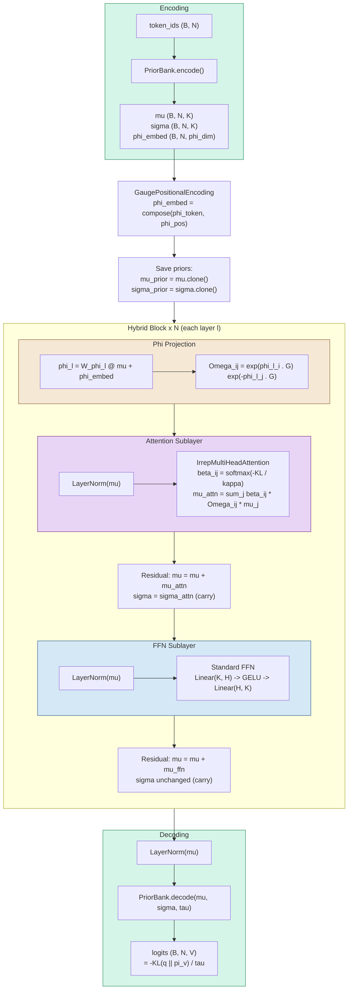

# Hybrid Gauge-Attention Transformer

A standard neural transformer body with gauge-theoretic KL-divergence attention, designed as a controlled ablation architecture for isolating the contribution of information-geometric attention from the variational free energy feedforward network.

## Motivation

The full gauge transformer (`GaugeTransformerLM`) replaces both the attention mechanism and the feedforward network with gauge-theoretic components: KL-divergence attention over transported Gaussian beliefs replaces dot-product attention, and the VFE E-step replaces the standard GELU FFN. This makes it difficult to attribute performance differences to a single component.

The hybrid architecture isolates gauge attention by embedding it within an otherwise conventional transformer. It retains the standard two-layer GELU feedforward network, pre-norm LayerNorm, and residual connections, but replaces the learned $W_Q$, $W_K$ projections with KL-divergence scoring over gauge-transported belief distributions. The PriorBank module provides a unified encode/decode interface: tokens map to Gaussian belief tuples $(\mu, \Sigma, \phi)$ on input, and logits are computed via KL divergence to all token priors on output.

This design enables three controlled comparisons:

| Comparison | What varies | What is held constant |
|---|---|---|
| Standard vs. Hybrid | Attention mechanism (dot-product vs. KL-gauge) | FFN, LayerNorm, residuals, training loop |
| Hybrid vs. Full Gauge | FFN (GELU MLP vs. VFE E-step) | Attention mechanism, PriorBank, gauge transport |
| Standard vs. Full Gauge | Both attention and FFN | Training loop, data, sequence length |

## Why Phi Must Evolve Per-Layer

In the isotropic covariance limit ($\Sigma = \sigma^2 I$), the KL attention logit between positions $i$ and $j$ reduces to a bilinear form:

$$-\mathrm{KL}(q_i \| \Omega_{ij}[q_j]) \;\propto\; -\frac{1}{2\sigma^2}\|\mu_i - \Omega_{ij}\mu_j\|^2 \;=\; \frac{1}{\sigma^2}\,\mu_i^\top \Omega_{ij}\,\mu_j \;-\; \text{(terms diagonal in } i \text{ or } j\text{)}$$

Compare with standard dot-product attention:

$$q_i^\top k_j = x_i^\top W_Q^\top W_K\, x_j$$

The transport operator $\Omega_{ij}$ plays the role of $W_Q^\top W_K$: it defines the bilinear scoring geometry between positions. In a standard transformer, each layer has independent $W_Q^{(\ell)}, W_K^{(\ell)}$ projections, giving layer-specific attention patterns. If $\phi$ is fixed after embedding, then $\Omega_{ij}$ is identical at every layer — equivalent to weight-tying $W_Q W_K^\top$ across the entire depth of the network. This is severely underparameterized: the only quantity varying layer-to-layer would be $\mu$ (from FFN residuals), but the projection that scores attention is frozen.

The fix is a **per-layer phi projection** that gives each layer its own transport operators. Each hybrid block contains a learned linear mapping:

$$\phi_i^{(\ell)} = W_\phi^{(\ell)}\,\mu_i^{(\ell)} + \phi_i^{(\text{embed})}$$

where $W_\phi^{(\ell)} \in \mathbb{R}^{n_\text{gen} \times K}$ is a per-layer projection from belief means to gauge frames, and $\phi^{(\text{embed})}$ is the base frame from PriorBank (with positional encoding composed in). This is the gauge-theoretic analog of the per-layer $W_Q, W_K$ projections: the content of $\mu$ at each layer determines the gauge frame, and hence the transport geometry, for that layer's attention computation.

For multi-head GL($d_\text{head}$) with $H$ heads, $n_\text{gen} = H \times d_\text{head}^2$. The phi projection $W_\phi^{(\ell)}$ has $K \times n_\text{gen}$ parameters, compared to $2K^2$ for $W_Q + W_K$ in standard attention. For typical configurations ($H=4$, $d_\text{head}=10$, $K=40$), these are $40 \times 400 = 16\text{K}$ vs. $2 \times 1600 = 3.2\text{K}$ parameters — the phi projection is larger but subsumes both query and key functions in a single mapping.

## Architecture Diagram



## Component Descriptions

### PriorBank (Encode and Decode)

**Source:** `transformer/core/prior_bank.py`

The PriorBank replaces both `nn.Embedding` (input) and `nn.Linear` (output head) with a unified module grounded in information geometry. Each vocabulary token $v$ carries a prior belief distribution $\pi_v = \mathcal{N}(\mu_v, \Sigma_v)$ and a gauge frame $\phi_v \in \mathfrak{g}$.

**Encoding.** Given input token IDs $(B, N)$, the bank returns per-token prior beliefs:

$$\text{encode}(y_t) \;\to\; \bigl(\mu_{y_t},\;\sigma_{y_t},\;\phi_{y_t}\bigr)$$

where $\mu \in \mathbb{R}^K$ is the belief mean, $\sigma \in \mathbb{R}^K$ the diagonal covariance, and $\phi \in \mathbb{R}^{n_\text{gen}}$ the Lie algebra gauge frame. When `gauge_fixed_priors=True`, all priors are gauge transforms of a single base prior: $\pi_v = \exp(\phi_v \cdot G) \triangleright \pi_0$, guaranteeing gauge covariance by construction.

**Decoding.** Given evolved beliefs $q = \mathcal{N}(\mu_q, \Sigma_q)$ from the transformer stack, logits are computed as negative KL divergences to all token priors:

$$\text{logit}_v = -\frac{1}{2\tau} \, \mathrm{KL}(q \,\|\, \pi_v)$$

This is implemented as a single fused matrix multiplication over concatenated sufficient statistics, achieving $O(NKV)$ complexity identical to a standard linear output projection.

**Learned parameters:** `prior_mu` $(V, K)$, `log_prior_sigma` $(V, K)$, `phi_embed` $(V, n_\text{gen})$, optional `decode_log_scale` (scalar).

### IrrepMultiHeadAttention (Gauge KL-Attention)

**Source:** `transformer/core/attention.py:2252`

The gauge attention mechanism replaces the standard $\text{softmax}(QK^\top/\sqrt{d})$ scoring with KL divergences between gauge-transported Gaussian beliefs. There are no learned $W_Q$ or $W_K$ projection matrices.

For positions $i$ and $j$, the transport operator $\Omega_{ij}$ maps belief $q_j$ into the coordinate frame of position $i$:

$$\Omega_{ij} = \exp\!\Bigl(\sum_a \phi_i^a T_a\Bigr) \cdot \exp\!\Bigl(-\sum_a \phi_j^a T_a\Bigr)$$

where $\{T_a\}$ are Lie algebra generators of the gauge group ($\mathrm{GL}(K)$, $\mathrm{SO}(N)$, or $\mathrm{SO}(3)$). Attention weights are then:

$$\beta_{ij} = \text{softmax}_j\!\left(\frac{-\mathrm{KL}\bigl(q_i \,\|\, \Omega_{ij}[q_j]\bigr)}{\kappa \sqrt{K}}\right)$$

where the transported belief is $\Omega_{ij}[q_j] = \mathcal{N}(\Omega_{ij}\mu_j,\; \Omega_{ij}\Sigma_j\Omega_{ij}^\top)$. The covariance transport uses the sandwich product $\Omega\Sigma\Omega^\top$ — this is a hard correctness constraint for gauge equivariance.

Message aggregation produces updated beliefs:

$$\mu_i^{\text{attn}} = \sum_j \beta_{ij}\;\Omega_{ij}\,\mu_j, \qquad \Sigma_i^{\text{attn}} = \sum_j \beta_{ij}\;\Omega_{ij}\,\Sigma_j\,\Omega_{ij}^\top$$

**Interface:**

```python
forward(
    mu_q:    (B, N, K),          # belief means
    sigma_q: (B, N, K),          # diagonal covariances (or (B,N,K,K) full)
    phi:     (B, N, phi_dim),    # gauge frames
    generators: (n_gen, K, K),   # Lie algebra generators
    mask:    (B, N, N),          # causal mask
) -> (mu_out, sigma_out, attn_weights, kl_matrices)
```

**Learned parameters:** optional per-head $\kappa_h$ (`log_kappa_per_head`), optional $W_O$ output projection, optional per-head constant $\Omega$ (in `gauge_mode='constant'`).

### Standard GELU FFN

**Source:** `transformer/baselines/standard_transformer.py:187`

The feedforward sublayer is a conventional two-layer MLP with GELU activation:

$$\text{FFN}(x) = W_2\;\text{GELU}(W_1 x + b_1) + b_2$$

where $W_1 \in \mathbb{R}^{H \times K}$, $W_2 \in \mathbb{R}^{K \times H}$, and $H$ is the hidden dimension (typically $4K$). This operates on the mean vector $\mu$ only. The covariance $\Sigma$ and gauge frame $\phi$ pass through unchanged.

**Learned parameters:** `fc1.weight` $(H, K)$, `fc1.bias` $(H)$, `fc2.weight` $(K, H)$, `fc2.bias` $(K)$.

## Hybrid Block Data Flow

The interface bridge between gauge attention (which operates on belief tuples) and the standard FFN (which operates on plain tensors) is the central design element. Each block has a per-layer phi projection that makes gauge frames content-dependent, followed by KL-attention and a standard GELU FFN:

```
Input: (mu, sigma, phi_embed)
                │
    ┌───────────┴───────────┐
    │   PHI PROJECTION       │
    │                        │
    │  phi_l = W_phi @ mu    │  ← per-layer Linear(K, phi_dim)
    │         + phi_embed    │  ← add base frame from PriorBank
    └───────────┬───────────┘
                │
    ┌───────────┴───────────┐
    │   ATTENTION SUBLAYER   │
    │                        │
    │  mu_norm = LN(mu)      │
    │  (mu_attn, sigma_attn, │
    │   beta, kl) =          │
    │   GaugeAttn(mu_norm,   │
    │     sigma, phi_l, G,   │  ← layer-specific phi
    │     mask)              │
    │                        │
    │  mu = mu + mu_attn     │  ← residual on mu
    │  sigma = sigma_attn    │  ← replaced (from attention aggregation)
    └───────────┬───────────┘
                │
    ┌───────────┴───────────┐
    │     FFN SUBLAYER       │
    │                        │
    │  mu_norm = LN(mu)      │
    │  mu_ffn = FFN(mu_norm) │  ← standard GELU MLP
    │                        │
    │  mu = mu + mu_ffn      │  ← residual on mu
    │  sigma = sigma         │  ← unchanged (carry-through)
    └───────────┬───────────┘
                │
Output: (mu, sigma, phi_embed)
```

The phi projection is the gauge-theoretic analog of per-layer $W_Q, W_K$ projections. It reads the current $\mu$ (which evolves through FFN residuals at each layer) and produces a layer-specific gauge frame that determines the transport geometry for that layer's attention computation. The base embedding frame $\phi_\text{embed}$ (with positional encoding already composed in) serves as a bias term, ensuring that even at initialization the transport encodes token identity and position.

The standard FFN reads and writes only $\mu$. The covariance $\Sigma$ from the attention aggregation carries through the FFN unchanged and ultimately reaches `PriorBank.decode()`, where it contributes to the KL-based logit computation.

## Comparison of Three Architectures

| Component | Standard Transformer | Hybrid Gauge-Attention | Full Gauge VFE |
|---|---|---|---|
| **Embedding** | `nn.Embedding` $(V, K)$ | `PriorBank` $(\mu, \Sigma, \phi)$ | `PriorBank` $(\mu, \Sigma, \phi)$ |
| **Position** | Learned or RoPE on $x$ | Composed into $\phi$ (Lie algebra) | Composed into $\phi$ (Lie algebra) |
| **Attention** | $\text{softmax}(QK^\top/\sqrt{d})$ | $\text{softmax}(-\text{KL}/\kappa)$ | $\text{softmax}(-\text{KL}/\kappa)$ |
| **Q/K projections** | $W_Q, W_K \in \mathbb{R}^{K \times K}$ | None (gauge transport) | None (gauge transport) |
| **V projection** | $W_V \in \mathbb{R}^{K \times K}$ | None (transported $\mu_j$) | None (transported $\mu_j$) |
| **FFN** | `Linear-GELU-Linear` | `Linear-GELU-Linear` | VFE E-step iterations |
| **State per position** | $x \in \mathbb{R}^K$ | $(\mu, \Sigma, \phi)$ | $(\mu, \Sigma, \phi)$ |
| **Output head** | `nn.Linear` $(K \to V)$ | `PriorBank.decode` (KL) | `PriorBank.decode` (KL) |
| **Covariance evolution** | N/A | Attention only | Attention + VFE E-step |
| **Phi evolution** | N/A (implicit in $W_Q, W_K$) | Per-layer $W_\phi^{(\ell)}\mu + \phi_\text{embed}$ | VFE E-step $\partial F/\partial\phi$ |
| **Nonlinearity source** | GELU activation | GELU + KL softmax | KL softmax + $\partial\beta/\partial\mu$ |

## Training Integration

The hybrid model is compatible with the existing training infrastructure in `transformer/train.py` and `transformer/training/train_fast.py`.

**Loss function.** The primary loss is cross-entropy on `PriorBank.decode()` logits. Optional VFE regularizers from `compute_free_energy_loss()` remain applicable:

$$\mathcal{L} = \underbrace{\text{CE}(\text{logits}, y)}_{\text{observation}} + \underbrace{M_\alpha \sum_i \text{KL}(q_i \| p_i)}_{\text{self-coupling (optional)}} + \underbrace{\tfrac{m_\phi}{2}\|\phi\|^2_F}_{\text{gauge prior (optional)}}$$

The belief alignment term $M_\beta \sum_{ij} \beta_{ij}\text{KL}(q_i \| \Omega_{ij}q_j)$ can also be included, but since there is no VFE E-step to refine beliefs, its gradient flows directly through the attention weights and PriorBank embeddings.

**Optimizer.** The parameter-group routing in `transformer/training/optimizer.py` uses name-based matching. The hybrid model's parameters map naturally to existing groups: `prior_bank.prior_mu` routes to the embedding group, `attention` parameters route to the attention group, and `ffn.fc1`/`ffn.fc2` route to the FFN group.

**`forward_with_attention()` interface.** For training compatibility, the hybrid model returns the same `(logits, attention_info)` tuple as `GaugeTransformerLM`, where `attention_info` contains per-layer `beta` (attention weights), `kl` (KL matrices), and the final belief state `(mu, sigma, phi)` alongside the saved priors `(mu_prior, sigma_prior, phi_prior)`.

## Configuration Example

```python
HYBRID_CONFIG = {
    # Architecture
    'vocab_size': 50257,
    'embed_dim': 20,
    'n_layers': 2,
    'hidden_dim': 80,            # FFN hidden dim (4x embed_dim)
    'max_seq_len': 64,
    'irrep_spec': [('fund', 2, 10)],  # 2 heads x GL(10)

    # Gauge attention
    'kappa_beta': 0.1,
    'gauge_group': 'GLK',
    'gauge_mode': 'learned',
    'gauge_dim': 10,
    'diagonal_covariance': True,
    'use_rope': True,

    # PriorBank
    'use_prior_bank': True,
    'phi_scale': 0.3,
    'sigma_ce_scale': 0.1,

    # FFN: standard GELU (this is what distinguishes hybrid from full gauge)
    'ffn_mode': 'standard',
    'dropout': 0.1,

    # Training
    'batch_size': 64,
    'learning_rate': 3e-4,
    'max_steps': 15000,
    'warmup_steps': 1000,
}
```
